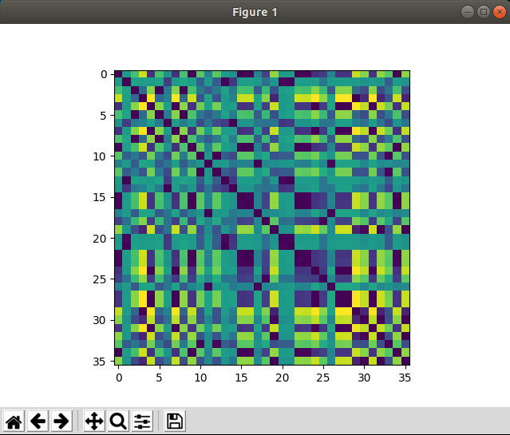
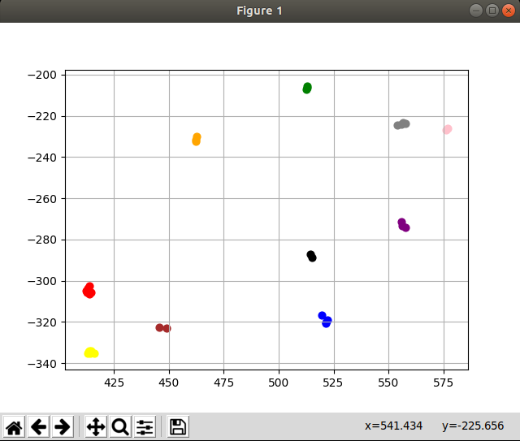
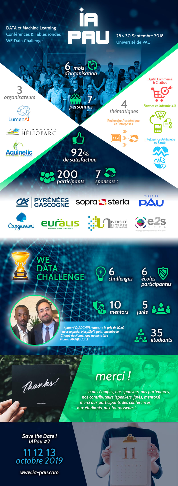

# WE Data Challenge - IAPau

## Team: Capte-data

* Subject: "Comment sensibiliser les enjeux de vie privée chez les collégiens grâce à des données de positions GPS ? Avec une problématique supplémentaire sur l'éthique"

## Used

### Web data preview

Open in your browser -> visu-web/index.html

### Required script python

``` bash
pip install sklearn --user
pip install matplotlib --user
sudo apt-get install python-tk
```

#### Usage

``` bash
./src/main.py [PATH TO CSV]
```

For exemple

``` bash
./src/main.py ./Docs/tact.csv
```

* Final render






## Final poster

